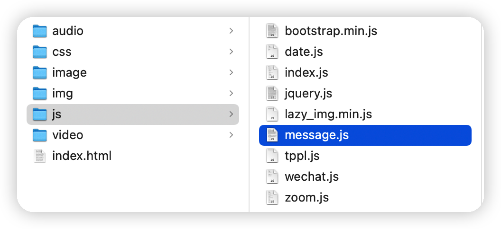
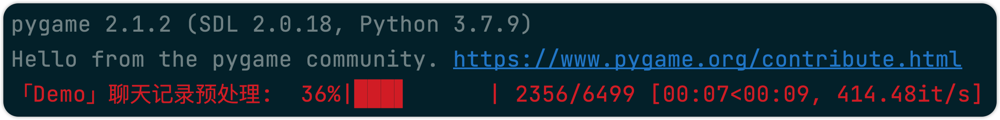

# 微信聊天记录分析报告

## 数据准备

本文采用 [WX Backup](http://wxbackup.imxfd.com) 这款工具来获取微信聊天记录。

### iTunes备份

用iTunes连接iPhone，将内容备份到电脑上。请注意，不要选择”给iPhone备份加密“！


### 聊天记录导出

根据选择的账号和联系人导出聊天记录，瞬间即可导出选中的聊天记录。支持增量导出，即有新的内容更新到iPhone备份文件后，可以增加更新的内容到导出记录中。


### 获取聊天记录 message.js 文件路径



## 运行软件

### 修改聊天记录路径

```python
import pygame

pygame.init()
info = pygame.display.Info()
wa = WeChatAnalysis(
    message_path_list=[f"xx/js/message.js"],
    width=info.current_w
)
wa.main()
```

### 运行程序



### 分析结果

